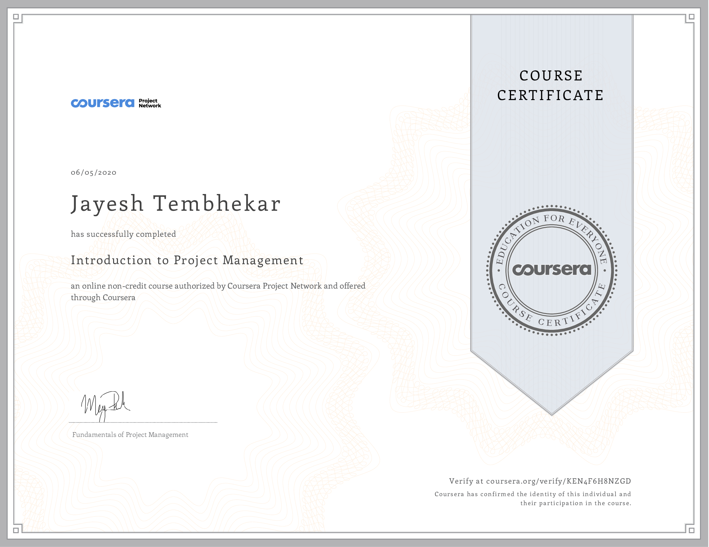

# Introduction to Relational database and SQL

✔ _verify certificate_ [**here**](https://www.coursera.org/account/accomplishments/verify/X73U45XCBAXS "coursera.org/verify")

---

# Getting Started in Google Analytics

✔ _verify certificate_ [**here**](https://www.coursera.org/account/accomplishments/verify/A8T7DD3NY9RM "coursera.org/verify")

---

# Introduction to Project Management

✔ _verify certificate_ [**here**](https://www.coursera.org/account/accomplishments/verify/KEN4F6H8NZGD "coursera.org/verify")

---
